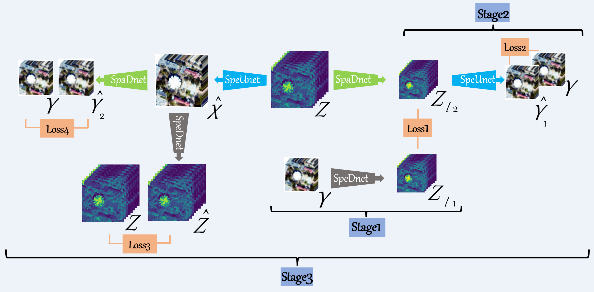
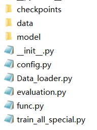

# UDALN_GRSL
Deep Unsupervised Blind Hyperspectral and Multispectral Data Fusion, GRSL. (PyTorch)
<!--  
 [Jiaxin Li 李嘉鑫](https://www.researchgate.net/profile/Li-Jiaxin-20), [Ke Zheng 郑珂](https://www.researchgate.net/profile/Ke-Zheng-9), [Jing Yao 姚靖](https://scholar.google.com/citationsuser=1SHd5ygAAAAJ&hl=en), [Lianru Gao 高连如](https://scholar.google.com/citations?hl=en&user=f6OnhtcAAAAJ), and [Danfeng Hong 洪丹枫](https://sites.google.com/view/danfeng-hong), IEEE Geoscience and Remote Sensing Letter (GRSL). 

文章可在这里下载🖼️[**PDF**](./Imgs/UDALN.pdf)，The final version can be downloaded in  🖼️[**PDF**](./Imgs/UDALN.pdf) 

# $\color{red}{欢迎添加 我的微信(WeChat): BatAug，欢迎交流与合作}$

## 本人还提出了其余多个开源的高光谱-多光谱超分融合代码，可移步至[GitHub主页下载](https://github.com/JiaxinLiCAS) 

### 我是李嘉鑫，25年毕业于中科院空天信息创新研究院的直博生，导师高连如研究员 ###

我的英文版本个人简历可在隔壁仓库下载，如您需要此简历模板可以通过微信联系我。
My english CV can be downloaded in this repository .

2025.09——, 就职于重庆邮电大学 计算机科学与技术学院 文峰副教授 $\color{red}{博后导师：韩军伟教授}$ 
【[官网](https://teacher.nwpu.edu.cn/hanjunwei.html)，[谷歌学术主页](https://scholar.google.com/citations?user=xrqsoesAAAAJ&hl=zh-CN&oi=ao)】

2020.09-2025.07 就读于中国科学院 空天信息创新研究院 五年制直博生 $\color{red}{导师：高连如研究员}$ 【[导师空天院官网](https://people.ucas.ac.cn/~gaolianru)，[谷歌学术主页](https://scholar.google.com/citations?user=La-8gLMAAAAJ&hl=zh-CN)】

2016.09-2020.7 就读于重庆大学 土木工程学院 测绘工程专业

From 2025.09, I work at the School of Computer Science and Technology (National Exemplary Software School), Chongqing University of Posts and Telecommunications, as a Wenfeng associate professor.
My postdoctoral supervisor is [Junwei Han](https://scholar.google.com/citations?user=La-8gLMAAAAJ&hl=zh-CN).

From 2020.09 to 2025.07, I am a PhD candidate at the Key Laboratory of Computational Optical Imaging Technology, Aerospace Information Research Institute, Chinese Academy of Sciences, Beijing, China.
My supervisor is [Lianru Gao](https://scholar.google.com/citations?user=La-8gLMAAAAJ&hl=zh-CN).

From 2016.0 to 2020.7, I studied in the school of civil engineering at Chongqing University, Chongqing, China, for a Bachelor of Engineering.

这是我的[谷歌学术](https://scholar.google.com/citations?user=aSPDpmgAAAAJ&hl=zh-CN)和[ResearchGate](https://www.researchgate.net/profile/Jiaxin-Li-lijiaxin?ev=hdr_xprf)，More information can be found in my [Google Scholar Citations](https://scholar.google.com/citations?user=aSPDpmgAAAAJ&hl=zh-CN) and my [ResearchGate](https://www.researchgate.net/profile/Jiaxin-Li-lijiaxin?ev=hdr_xprf)
-->

# 代码解析 👇 有助你读懂代码 便于复现

🖼️**遇到任何问题，包括但不限于代码调试、数据仿真、运行结果等，随时添加**
$\color{red}{我的微信(WeChat): BatAug，欢迎交流与合作}$

**Fig.1.** Architecture of the proposed unsupervised degradations adaptive learning network, abbreviated as UDALN, for the task of HSI-MSI fusion.

## Directory structure

**Fig.2.** Directory structure. There are three folders and six .py files in UDALN_GRSL-master.

### checkpoints
This folder is used to store the training results and a folder named `houston18_5_S1=0.001_20000_10000_S2=0.001_30000_20000_S3=6e-05_15000_5000` is given as a example.

- `convolution_hr2msi.pth` is the trained result of SpeDnet, `PSF.pth` is the trained result of SpaDnet, and `spectral_upsample.pth` is the trained result of SpeUnet.

- `opt.txt` is used to store the training configuration.

- `precision.txt` is used to store the training precision.

- `My_Out.mat` is the final reconstructed HHSI.

### data
This folder is used to store the ground true HHSI and corresponding spectral response of multispectral imager. The HSI data used in [2018 IEEE GRSS Data Fusion Contest](https://hyperspectral.ee.uh.edu/?page_id=1075)  and spectral response of WorldView 2 multispectral imager are given as a example here.

### model
This folder consists four .py files, including `spatial_downsample.py(SpaDnet)`, `spectral_downsample.py(SpeDnet)`, `spectral_upsample.py(SpeUnet)`, and `__init__.py`.

### other five .py files
- `config.py`: all the parameters in our methed.

- `Data_loader.py`: generate the simulated low HSI and high MSI.

- `evaluation.py`: compute five metrics, which will be stored in `precision.txt`.

- `func.py`: some functions used in `train_all_special.py`.

- `train_all_special.py`: main.py

## How to run our code
- Requirements: codes of networks were tested using PyTorch 1.9.0 version (CUDA 11.4) in Python 3.8.10 on Windows system. For the required packages, please refer to detailed .py files.

- Parameters: all the parameters need fine-tunning can be found in `config.py`, including the learning rate decay strategy of three training stages.

- Data: put your HSI data and MSI spectral reponse in `./data/data_name` and `./data/spectral_response`, respectively.The HSI data used in [2018 IEEE GRSS Data Fusion Contest](https://hyperspectral.ee.uh.edu/?page_id=1075)  and spectral response of WorldView 2 multispectral imager are given as a example here.

- Run: just simply run `train_all_special.py` after adjust the parameters in `config.py`.

- Results: one folder named `dataname_SF_S1=x1_y1_z1_S2=x2_y2_z2_S3=x3_y3_z3` will be generated once `train_all_special.py` is run and all the results will be stored in the new folder. A folder named `houston18_5_S1=0.001_20000_10000_S2=0.001_30000_20000_S3=6e-05_15000_5000` is given as a example here.

## References

Our work is inspired by the following paper

[1] Zheng, Ke, et al. "Coupled convolutional neural network with adaptive response function learning for unsupervised hyperspectral super-resolution." *IEEE Transactions on Geoscience and Remote Sensing* (2020), DOI: 10.1109/TGRS.2020.3006534.

[2] Yao, Jing, et al. "Cross-attention in coupled unmixing nets for unsupervised hyperspectral super-resolution." In *Proceedings of the European Conference on Computer Vision (ECCV)* (2020), pp. 208-224.

[3] Han, Xiaolin, et al. "Hyperspectral and Multispectral Image Fusion Using Cluster-Based Multi-Branch BP Neural Networks" *Remote Sensing* (2019), DOI: 10.3390/rs11101173.

## Contact

If you encounter any bugs while using this code, please do not hesitate to contact us.

🖼️**遇到任何问题，包括但不限于代码调试、数据仿真、运行结果等，随时添加**
$\color{red}{我的微信(WeChat): BatAug，欢迎交流与合作}$

